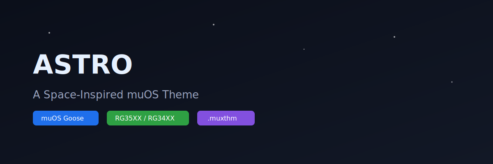
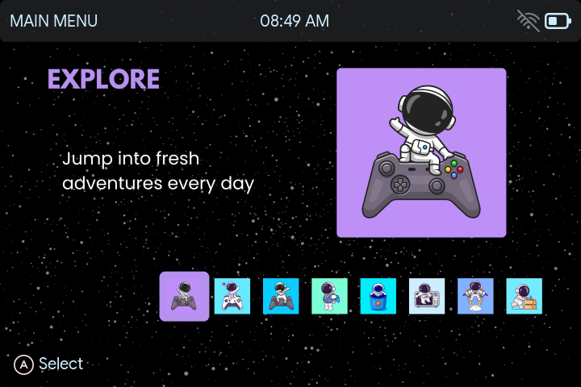
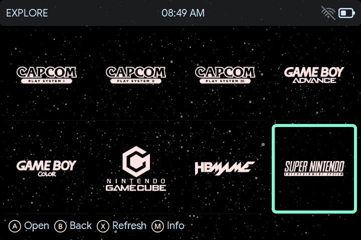
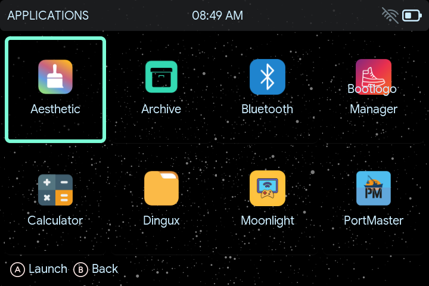
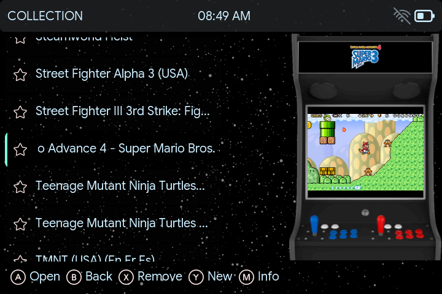
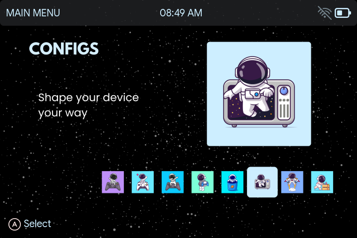
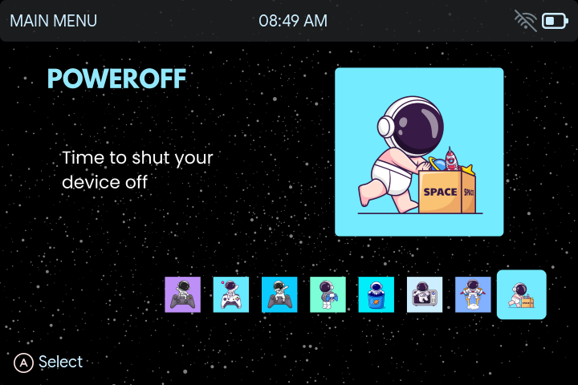

  

<h1 align="center">🌌 Astro – muOS Theme</h1>

  <b>A clean, space-inspired UI theme for muOS handhelds</b>

  
  
  

<h2>✨ Overview</h2>

Astro is a modern, minimal muOS theme inspired by space exploration.
It features consistent astronaut artwork, soft pastel accents, and a dark
starfield background designed for long gaming sessions.

<ul>
  <li>🎨 Custom astronaut illustrations</li>
  <li>🌌 Dark starfield background</li>
  <li>🕹 Console-style navigation</li>
  <li>⚡ Optimized for small handheld screens</li>
</ul>

<h2>🖼️ Screenshots</h2>

<h3>🏠 Home</h3>

<h3>🧭 Explore</h3>

<h3>📱 Apps</h3>

<h3>📚 Collections</h3>

<h3>⚙️ Configs</h3>

<h3>⏻ Power Off</h3>

<h2>📥 Download & Install</h2>

<ol>
  <li>Go to the <b>Releases</b> section</li>
  <li>Download <code>Astro.muxthm</code></li>
  <li>Copy it to:
    <pre>/MUOS/theme/</pre>
  </li>
  <li>Enable via:
    <pre>Config → Customisation → Themes</pre>
  </li>
</ol>

<h2>🕹️ Compatibility</h2>

<ul>
  <li>✅ muOS Goose (2508.x)</li>
  <li>✅ 720x480</li>
  <li>✅ 640x480</li
</ul>

<h2>🧑‍🎨 Author</h2>

Created by <b>Ronax</b> 
Made for the muOS community ❤️

<h2>📜 License</h2>

MIT License

